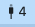
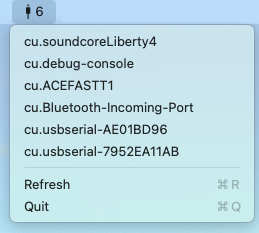

# USB Serial Port Monitor

Macのメニューバーに常駐し、接続されているUSBシリアルポートを表示・コピーできるアプリケーション。

## 機能

- 🔌 **シリアルポートの自動検出**: USBシリアル変換ケーブルの接続を自動的に検出
- 📋 **ワンクリックでコピー**: ポート名をクリックするだけで、デバイスパスをクリップボードにコピー
- 🔔 **接続/切断通知**: デバイスの接続時・切断時にポップアップ通知を表示
- 📊 **接続順表示**: 新しく接続したデバイスは接続順にリストの後ろに追加（既存デバイスはアルファベット順）
- 🔄 **手動更新**: メニューから手動でポートを再スキャン可能
- ⚡ **省電力**: IOKit通知によるリアルタイム検出（ポーリング不要）

## スクリーンショット

メニューバーにアイコンが表示され、ポート数がバッジとして表示されます：



メニューを開くと、利用可能なシリアルポートが一覧表示されます：



デバイス接続時には通知が表示されます：


## 動作環境

- macOS 14.0 以降
- Apple Silicon (M1/M2/M3/M4)

## インストール

### リリース版からインストール

[Releases](https://github.com/Shinichi-Ohki/Usb_Serial_Port_Monitor/releases) から最新の `Usb_Serial_Port_Monitor-v*.zip` をダウンロードして展開し、Applications フォルダにコピーしてください。

⚠️ **初回起動時の注意**: コード署名されていないため、macOSのGatekeeperにブロックされます。以下のコマンドで検疫属性を解除してから起動してください：

```bash
xattr -cr SerialPortMenuApp.app
```

### Homebrew でインストール

```bash
brew install --cask usb-serial-port-monitor
```

（※ Cask を作成したら）

## ソースからビルド

### ビルド済みアプリを作成

```bash
# リポジトリをクローン
git clone https://github.com/Shinichi-Ohki/Usb_Serial_Port_Monitor.git
cd Usb_Serial_Port_Monitor

# Swift Package Manager でビルド
swift build

# アプリバンドルを作成
mkdir -p Usb_Serial_Port_Monitor.app/Contents/MacOS
mkdir -p Usb_Serial_Port_Monitor.app/Contents/Resources
cp .build/debug/SerialPortMenu Usb_Serial_Port_Monitor.app/Contents/MacOS/

# Info.plist を作成
cat > Usb_Serial_Port_Monitor.app/Contents/Info.plist << 'EOF'
<?xml version="1.0" encoding="UTF-8"?>
<!DOCTYPE plist PUBLIC "-//Apple//DTD PLIST 1.0//EN" "http://www.apple.com/DTDs/PropertyList-1.0.dtd">
<plist version="1.0">
<dict>
    <key>CFBundleExecutable</key>
    <string>SerialPortMenu</string>
    <key>CFBundleIdentifier</key>
    <string>com.serialportmenu.app</string>
    <key>CFBundleInfoDictionaryVersion</key>
    <string>6.0</string>
    <key>CFBundleName</key>
    <string>Usb_Serial_Port_Monitor</string>
    <key>CFBundlePackageType</key>
    <string>APPL</string>
    <key>CFBundleShortVersionString</key>
    <string>1.0.0</string>
    <key>CFBundleVersion</key>
    <string>1</string>
    <key>LSMinimumSystemVersion</key>
    <string>14.0</string>
    <key>LSUIElement</key>
    <true/>
    <key>NSPrincipalClass</key>
    <string>NSApplication</string>
</dict>
</plist>
EOF

# アプリを起動
open Usb_Serial_Port_Monitor.app
```

### Xcode でビルド

```bash
# リポジトリをクローン
git clone https://github.com/Shinichi-Ohki/Usb_Serial_Port_Monitor.git
cd Usb_Serial_Port_Monitor

# Xcode でプロジェクトを開く
open SerialPortMenu.xcodeproj

# Xcode で ⌘R を押してビルド＆実行
```

## 使い方

1. アプリを起動すると、メニューバー右上にケーブルコネクタのアイコンが表示されます
2. アイコンの横の数字は現在接続されているシリアルポートの数です
3. アイコンをクリックしてメニューを開きます
4. ポート名をクリックすると、デバイスパスがクリップボードにコピーされます
5. 「Refresh」で手動でポートを再スキャンできます
6. 「Quit」でアプリを終了します

## 対応デバイス

以下のタイプのUSBシリアル変換ケーブルに対応しています：

- FTDI (FT232RL, FT231X, etc.)
- Silicon Labs (CP2102, CP2104, etc.)
- CH340/CH341
- PL2303
- その他大多数のUSB-シリアル変換ケーブル

対応デバイスを追加したい場合は、[Issue](https://github.com/Shinichi-Ohki/Usb_Serial_Port_Monitor/issues) を作成してください。

## 開発

### 必要なツール

- Xcode 15.0 以降
- Swift 5.9 以降
- macOS 14.0 以降

### プロジェクト構造

```
Usb_Serial_Port_Monitor/
├── SerialPortMenu/
│   ├── main.swift               # アプリエントリーポイント
│   ├── SerialPortMenuApp.swift  # AppDelegate
│   ├── SerialPortMonitor.swift  # シリアルポート監視
│   ├── MenuBarView.swift        # メニューバーUI & 通知
│   └── Info.plist               # バンドル設定
├── Package.swift                 # Swift Package Manager設定
├── app.png                       # アイコンソース
├── README.md                     # 本ファイル
└── LICENSE                       # MIT License
```

### 技術スタック

- **言語**: Swift
- **フレームワーク**: AppKit, Foundation, IOKit, Combine
- **アーキテクチャ**: pure AppKit（SwiftUI不使用）

## 既知の問題

- ありません

## 貢献

バグ報告やプルリクエストは [Issues](https://github.com/Shinichi-Ohki/Usb_Serial_Port_Monitor/issues) ページからお願いします。

## ライセンス

MIT License. 詳細は [LICENSE](LICENSE) ファイルを参照してください。

## 作者

[@Shinichi-Ohki](https://github.com/Shinichi-Ohki)

## 謝辞

- **アイデア元**: [@dannymodules](https://x.com/dannymodules/status/2016491542052233532) さんのWindows版タスクバー常駐アプリ
- アプリアイコン: Nanobanana Pro

## 更新履歴

### 1.2.0 (2026-01-31)
- **IOKitリアルタイム監視**: ポーリングを廃止し、IOKit通知で即座にデバイスを検出
- **コピー完了ポップアップ**: ポート名コピー時に青色のフィードバック通知を表示
- 初回起動時の不要な通知を抑制
- ポート検出の安定性向上（強制キャスト修正、メニュー更新の効率化）

### 1.1.0 (2026-01-29)
- **動的ポーリング機能**: 接続/切断検出時は1秒間隔、1時間安定後は5秒間隔に自動切り替え
- CPU使用率と省電力の改善

### 1.0.0 (2026-01-29)
- 初回リリース
- シリアルポートの自動検出
- クリップボードへのコピー機能
- 接続/切断通知
- 接続順ソート
